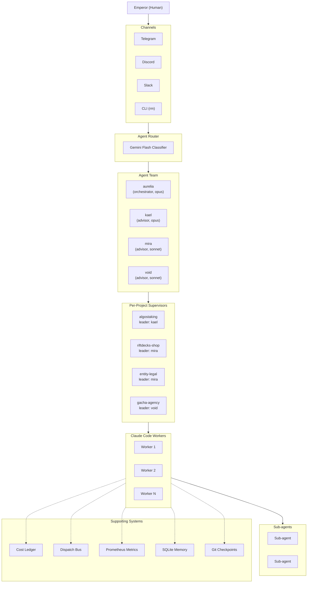
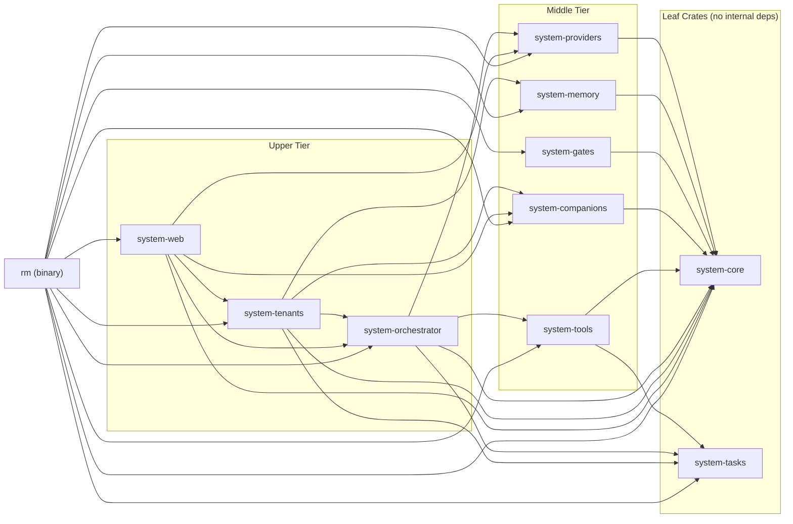
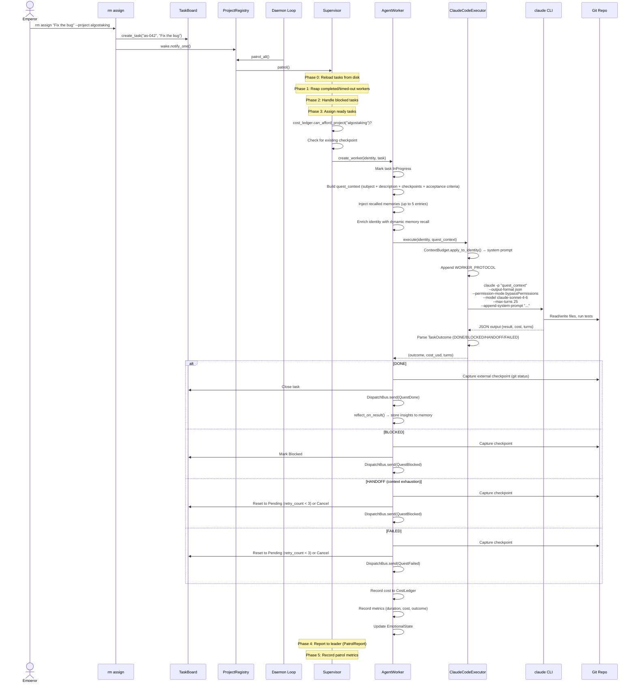
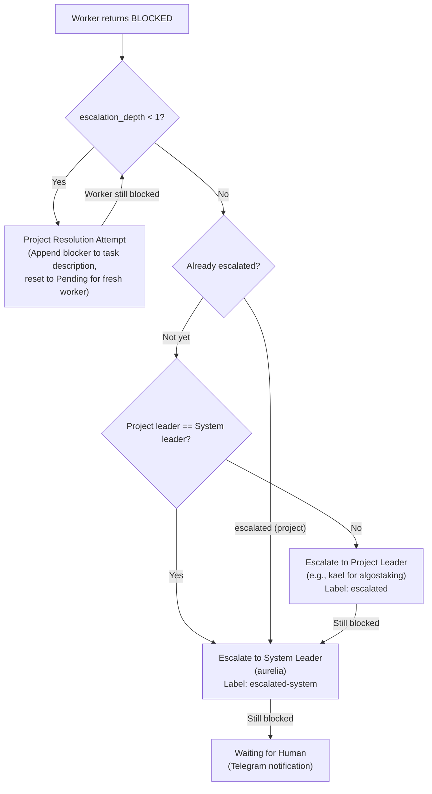
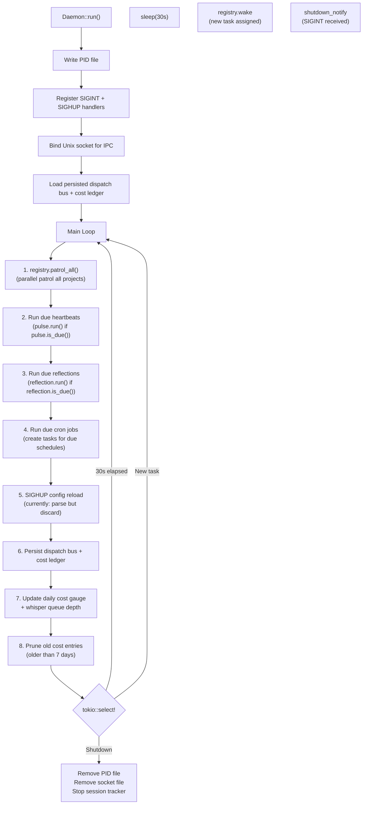
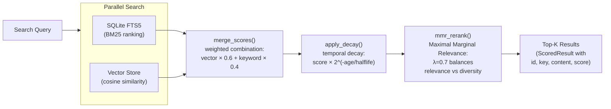
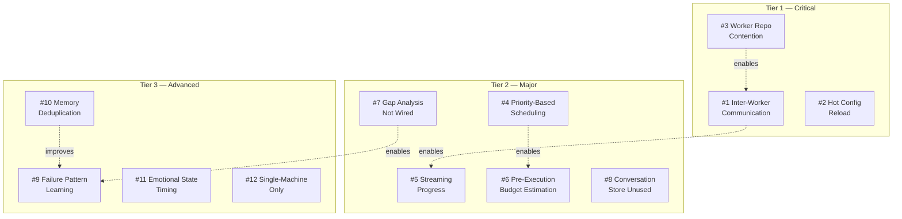

# Realm System Reference

> Recursive multi-agent orchestration framework in Rust. A single ~7MB binary (`rm`).

**Key stats**: 10 Rust crates, 25 orchestrator modules, 4 agents, 4 projects, 33 CLI subcommands, 144 tests, zero clippy warnings.

---

## Table of Contents

1. [Overview](#1-overview)
2. [Crate Map](#2-crate-map)
3. [Core Traits](#3-core-traits)
4. [Configuration Reference](#4-configuration-reference)
5. [Identity System](#5-identity-system)
6. [Execution Pipeline](#6-execution-pipeline)
7. [Escalation Chain](#7-escalation-chain)
8. [Daemon & Control Plane](#8-daemon--control-plane)
9. [Multi-Agent Routing](#9-multi-agent-routing)
10. [Memory System](#10-memory-system)
11. [Cost & Budget](#11-cost--budget)
12. [Observability](#12-observability)
13. [Checkpoints](#13-checkpoints)
14. [Self-Improvement](#14-self-improvement)
15. [Task System](#15-task-system)
16. [Scheduling & Templates](#16-scheduling--templates)
17. [Cross-Project Operations](#17-cross-project-operations)
18. [Security Model](#18-security-model)
19. [CLI Reference](#19-cli-reference)
20. [Directory Structure](#20-directory-structure)
21. [Road to Ultimate Orchestrator](#21-road-to-ultimate-orchestrator)

---

## 1. Overview

Realm is a multi-agent orchestration framework where **workers ARE orchestrators**. Each worker runs as a full Claude Code instance with Task tool access, enabling recursive sub-agent spawning. The system is designed around trait-driven swappability, budget-gated execution, and external observation over self-reporting.

### Design Principles

| Principle | Meaning |
|-----------|---------|
| Zero Framework Cognition | Agent loop is a thin shell. No hardcoded heuristics. The LLM decides everything. |
| Workers ARE Orchestrators | Claude Code workers have full Task tool access for recursive sub-agent spawning. |
| Observe, Don't Trust | Checkpoints captured externally via `git status` (GUPP pattern), not self-reported. |
| Budget-Gated Execution | `can_afford_project()` checked before every worker spawn. |
| Discovery Over Tracking | Config, repos, and identity files are discovered at runtime, not registered. |
| Trait-Driven Swappability | Provider, Tool, Memory, Observer, Channel, Embedder — all swappable interfaces. |
| Bootstrap Files Not Config | Agent identity comes from markdown files, not TOML knobs. |

### System Architecture



---

## 2. Crate Map

### Dependency Graph



### Crate Reference

| Crate | Path | Purpose | Key Exports |
|-------|------|---------|-------------|
| `system-core` | `crates/system-core/` | Foundation: traits, config, agent loop, security, identity | `SystemConfig`, `Identity`, `SecretStore`, `Agent`, 6 core traits |
| `system-tasks` | `crates/system-tasks/` | Git-native task DAG with JSONL storage | `TaskBoard`, `Task`, `TaskId`, `Mission`, `Priority`, `TaskStatus` |
| `system-providers` | `crates/system-providers/` | LLM provider implementations + cost estimation | `OpenRouterProvider`, `AnthropicProvider`, `OllamaProvider`, `ReliableProvider`, `OpenRouterEmbedder`, `estimate_cost` |
| `system-memory` | `crates/system-memory/` | Hybrid search: SQLite FTS5 + vector + temporal decay | `SqliteMemory`, `VectorStore`, `merge_scores`, `mmr_rerank`, `apply_decay`, `chunk_text` |
| `system-tools` | `crates/system-tools/` | Tool implementations for the agent loop | `ShellTool`, `FileReadTool`, `FileWriteTool`, `GitWorktreeTool`, `DelegateTool`, `BeadsCreateTool`, `Skill` |
| `system-gates` | `crates/system-gates/` | Messaging channel implementations | `TelegramChannel`, `DiscordChannel`, `SlackChannel` |
| `system-orchestrator` | `crates/system-orchestrator/` | The brain: 25 modules for full orchestration | `Daemon`, `Supervisor`, `AgentWorker`, `AgentRouter`, `ClaudeCodeExecutor`, `ProjectRegistry`, `CostLedger`, `DispatchBus`, `SystemMetrics`, `Council`, `Reflection`, `GapAnalyzer`, `EmotionalState`, `AgentCheckpoint` |
| `system-companions` | `crates/system-companions/` | Companion gacha system | `Companion`, `GachaEngine`, `CompanionStore`, `fuse` |
| `system-tenants` | `crates/system-tenants/` | Multi-tenant SaaS management | `TenantManager`, `Tenant`, auth functions, `EconomyBalance`, `EmailService` |
| `system-web` | `crates/system-web/` | Axum web server for gacha.agency | `AppState`, `start_server`, `build_router` |
| `rm` | `rm/src/main.rs` | CLI binary entry point (~3200 lines) | `Cli`, `Commands` enum with 33 subcommands |

---

## 3. Core Traits

All 6 traits are defined in `crates/system-core/src/traits/` and re-exported from `system_core::traits`.

### Provider

```rust
// crates/system-core/src/traits/provider.rs
#[async_trait]
pub trait Provider: Send + Sync {
    async fn chat(&self, request: &ChatRequest) -> Result<ChatResponse>;
    fn name(&self) -> &str;
    async fn health_check(&self) -> Result<()>;
}
```

**Associated types**: `ChatRequest`, `ChatResponse`, `Message`, `Role`, `MessageContent`, `ContentPart`, `ToolSpec`, `ToolCall`, `Usage`, `StopReason`

**Implementations**: `OpenRouterProvider`, `AnthropicProvider`, `OllamaProvider`, `ReliableProvider`

### Tool

```rust
// crates/system-core/src/traits/tool.rs
#[async_trait]
pub trait Tool: Send + Sync {
    async fn execute(&self, args: serde_json::Value) -> Result<ToolResult>;
    fn spec(&self) -> ToolSpec;
    fn name(&self) -> &str;
}
```

**Associated type**: `ToolResult` — `output: String`, `is_error: bool`

**Implementations**: 13 in `system-tools` (Shell, FileRead, FileWrite, ListDir, GitWorktree, Delegate, Porkbun, 6x Beads), 13 in `system-orchestrator` (ProjectStatus, ProjectAssign, ProjectList, MailRead, MailSend, AllReady, ChannelReply, UsageStats, MemoryStore, MemoryRecall, QuestDetail, QuestCancel, QuestReprioritize)

### Memory

```rust
// crates/system-core/src/traits/memory.rs
#[async_trait]
pub trait Memory: Send + Sync {
    async fn store(&self, key: &str, content: &str, category: MemoryCategory,
                   scope: MemoryScope, companion_id: Option<&str>) -> Result<String>;
    async fn search(&self, query: &MemoryQuery) -> Result<Vec<MemoryEntry>>;
    async fn delete(&self, id: &str) -> Result<()>;
    fn name(&self) -> &str;
}
```

**Enums**: `MemoryCategory` (`Fact`, `Procedure`, `Preference`, `Context`, `Evergreen`), `MemoryScope` (`Companion`, `Domain`, `Realm`)

**Implementation**: `SqliteMemory`

### Observer

```rust
// crates/system-core/src/traits/observer.rs
#[async_trait]
pub trait Observer: Send + Sync {
    async fn record(&self, event: Event);
    fn name(&self) -> &str;
}
```

**Event enum**: `AgentStart`, `AgentEnd`, `LlmRequest`, `LlmResponse`, `ToolCall`, `ToolError`, `Custom`

**Implementations**: `LogObserver` (tracing), `PrometheusObserver` (atomic counters) — both in `system-core`

### Channel

```rust
// crates/system-core/src/traits/channel.rs
#[async_trait]
pub trait Channel: Send + Sync {
    async fn start(&self) -> Result<tokio::sync::mpsc::Receiver<IncomingMessage>>;
    async fn send(&self, message: OutgoingMessage) -> Result<()>;
    async fn react(&self, chat_id: i64, message_id: i64, emoji: &str) -> Result<()>;
    fn name(&self) -> &str;
    async fn stop(&self) -> Result<()>;
}
```

**Implementations**: `TelegramChannel`, `DiscordChannel`, `SlackChannel`

### Embedder

```rust
// crates/system-core/src/traits/embedder.rs
#[async_trait]
pub trait Embedder: Send + Sync {
    async fn embed(&self, text: &str) -> Result<Vec<f32>>;
    fn dimensions(&self) -> usize;
}
```

**Implementation**: `OpenRouterEmbedder`

---

## 4. Configuration Reference

Configuration lives at `config/system.toml`. Discovered via `SystemConfig::discover()`:

1. Check `$SYSTEM_CONFIG` env var (falls back to `$REALM_CONFIG`)
2. Walk upward from CWD looking for `system.toml` then `realm.toml` (also in `config/` subdirectory)
3. Check `~/.sigil/system.toml` then `~/.sigil/realm.toml`

### `[system]`

| Field | Type | Default | Description |
|-------|------|---------|-------------|
| `name` | String | required | System instance name |
| `data_dir` | String | `"~/.sigil"` | Runtime data directory (PID, socket, costs, schedules) |

Serde alias: `[realm]` maps to `[system]`

### `[providers.openrouter]`

| Field | Type | Default | Description |
|-------|------|---------|-------------|
| `api_key` | String | required | Supports `${ENV_VAR}` expansion |
| `default_model` | String | `"anthropic/claude-sonnet-4.6"` | Default LLM model |
| `fallback_model` | String? | — | Fallback when primary fails |
| `embedding_model` | String? | — | Model for vector embeddings |

### `[providers.anthropic]`

| Field | Type | Default | Description |
|-------|------|---------|-------------|
| `api_key` | String | required | Supports `${ENV_VAR}` expansion |
| `default_model` | String | `"claude-sonnet-4-20250514"` | Default model |

### `[providers.ollama]`

| Field | Type | Default | Description |
|-------|------|---------|-------------|
| `url` | String | `"http://localhost:11434"` | Ollama API URL |
| `default_model` | String | `"llama3.1:8b"` | Default local model |

### `[security]`

| Field | Type | Default | Description |
|-------|------|---------|-------------|
| `autonomy` | Enum | `"supervised"` | `readonly`, `supervised`, or `full` |
| `workspace_only` | bool | `true` | Restrict tools to workspace directories |
| `max_cost_per_day_usd` | f64 | `10.0` | Global daily budget cap |
| `secret_store` | String? | — | Path to encrypted secret store |

### `[memory]`

| Field | Type | Default | Description |
|-------|------|---------|-------------|
| `backend` | String | `"sqlite"` | Memory backend type |
| `embedding_dimensions` | usize | `1536` | Vector embedding size |
| `vector_weight` | f64 | `0.6` | Weight for vector similarity in hybrid search |
| `keyword_weight` | f64 | `0.4` | Weight for BM25 keyword match |
| `temporal_decay_halflife_days` | f64 | `30.0` | Memory relevance half-life |
| `mmr_lambda` | f64 | `0.7` | MMR diversity parameter (1.0 = pure relevance) |
| `chunk_size_tokens` | usize | `400` | Document chunk size |
| `chunk_overlap_tokens` | usize | `80` | Overlap between chunks |

### `[heartbeat]`

| Field | Type | Default | Description |
|-------|------|---------|-------------|
| `enabled` | bool | `false` | Enable periodic health checks |
| `default_interval_minutes` | u32 | `30` | Minutes between pulses |
| `reflection_enabled` | bool | `false` | Enable identity drift detection |
| `reflection_interval_minutes` | u32 | `240` | Minutes between reflections |

Serde alias: `[pulse]` maps to `[heartbeat]`

### `[channels.telegram]`

| Field | Type | Default | Description |
|-------|------|---------|-------------|
| `token_secret` | String | required | Secret name for bot token |
| `allowed_chats` | Vec\<i64\> | required | Authorized chat IDs |
| `debounce_window_ms` | u64 | `3000` | Message debounce window |

### `[repos]`

Key-value map of repo name to path. Used by `resolve_repo()` for project config.

```toml
[repos]
sigil = "/home/claudedev/sigil"
algostaking = "/home/claudedev/algostaking-backend"
```

### `[team]` — System-Level Team

| Field | Type | Default | Description |
|-------|------|---------|-------------|
| `leader` | String | `"aurelia"` | System leader agent name |
| `agents` | Vec\<String\> | `[]` | Agents in system team |
| `router_model` | String | `"google/gemini-2.0-flash-001"` | Model for AgentRouter classification |
| `router_cooldown_secs` | u64 | `60` | Per-chat advisor cooldown |
| `max_background_cost_usd` | f64 | `0.50` | Max cost per background advisor invocation |

### `[[agents]]`

| Field | Type | Default | Description |
|-------|------|---------|-------------|
| `name` | String | required | Unique agent name |
| `prefix` | String | `"ag"` | Task ID prefix for agent tasks |
| `model` | String? | — | Agent's preferred LLM model |
| `role` | Enum | `"orchestrator"` | `orchestrator`, `worker`, or `advisor` |
| `voice` | Enum | `"vocal"` | `vocal` or `silent` |
| `execution_mode` | Enum | `"agent"` | `agent` (internal loop) or `claude_code` (CLI subprocess) |
| `max_workers` | u32 | `1` | Max concurrent workers |
| `max_turns` | u32? | — | Max LLM turns per execution |
| `max_budget_usd` | f64? | — | Max cost per execution |
| `default_repo` | String? | — | Key from `[repos]` or path |
| `expertise` | Vec\<String\> | `[]` | Project names for routing |
| `capabilities` | Vec\<String\> | `[]` | Special capabilities |
| `telegram_token_secret` | String? | — | Secret name for agent's Telegram bot |

### `[[projects]]`

| Field | Type | Default | Description |
|-------|------|---------|-------------|
| `name` | String | required | Unique project name |
| `prefix` | String | required | Task ID prefix (e.g., `"as"`) |
| `repo` | String | required | Path or key from `[repos]` |
| `model` | String? | — | Worker model for this project |
| `max_workers` | u32 | `2` | Max concurrent workers |
| `worktree_root` | String? | — | Git worktree base path |
| `execution_mode` | Enum | `"agent"` | `agent` or `claude_code` |
| `max_turns` | u32? | `Some(25)` | Max turns per worker |
| `max_budget_usd` | f64? | — | Per-task budget |
| `worker_timeout_secs` | u64 | `1800` | Worker timeout (30 min) |
| `max_cost_per_day_usd` | f64? | — | Per-project daily budget |
| `team.leader` | String | — | Project team leader |
| `team.agents` | Vec\<String\> | `[]` | Project team agents |

Serde alias: `worker_timeout_secs` accepts `spirit_timeout_secs`; `[[projects]]` accepts `[[domains]]`

### `[session]`

| Field | Type | Default | Description |
|-------|------|---------|-------------|
| `enabled` | bool | `false` | Enable session tracker |
| `checkin_interval_mins` | u64 | `30` | Periodic check-in interval |
| `alarm_interval_mins` | u64 | `60` | Idle alarm interval |
| `min_flood_interval_mins` | u64 | `30` | Anti-flood minimum gap |
| `deadline_mins` | u64? | — | One-shot session deadline |
| `notify_chat_id` | i64? | — | Telegram chat for notifications |

### `[context_budget]`

| Field | Type | Default (chars) | Description |
|-------|------|-----------------|-------------|
| `max_shared_workflow` | usize | 2,000 | Shared WORKFLOW.md budget |
| `max_persona` | usize | 4,000 | PERSONA.md budget |
| `max_agents` | usize | 8,000 | AGENTS.md budget |
| `max_knowledge` | usize | 12,000 | KNOWLEDGE.md budget |
| `max_preferences` | usize | 4,000 | PREFERENCES.md budget |
| `max_memory` | usize | 8,000 | MEMORY.md + dynamic recall budget |
| `max_checkpoints` | usize | 8,000 | Checkpoint context budget |
| `max_checkpoint_count` | usize | 5 | Max verbatim checkpoints |
| `max_total` | usize | 120,000 | Total system prompt budget (~30K tokens) |

Serde alias: `max_persona` accepts `max_soul`

### Validation

`SystemConfig::validate()` checks:
- Non-empty `system.name`
- No duplicate project names or prefixes
- No zero `worker_timeout_secs` or `max_workers`
- At least one orchestrator role agent
- No duplicate agent names or prefixes
- All project repos resolve
- Memory weights sum to ~1.0
- `chunk_overlap_tokens < chunk_size_tokens`
- `max_cost_per_day_usd > 0`
- All team references point to defined agents (`validate_teams()`)

### Environment Variable Expansion

API key fields support `${ENV_VAR}` syntax. If the env var is unset, the field resolves to an empty string. Tilde (`~`) in paths expands to the home directory.

---

## 5. Identity System

**File**: `crates/system-core/src/identity.rs`

Identity is assembled from two sources — agent personality + project context — then budget-truncated for the worker's system prompt.

### Identity Struct

```rust
pub struct Identity {
    pub persona: Option<String>,          // PERSONA.md from agent dir
    pub identity: Option<String>,         // IDENTITY.md from agent dir
    pub operational: Option<String>,      // OPERATIONAL.md from agent dir
    pub agents: Option<String>,           // AGENTS.md from project dir
    pub heartbeat: Option<String>,        // HEARTBEAT.md from project dir
    pub memory: Option<String>,           // MEMORY.md from agent dir
    pub knowledge: Option<String>,        // KNOWLEDGE.md from project dir
    pub preferences: Option<String>,      // PREFERENCES.md from agent dir
    pub shared_workflow: Option<String>,  // WORKFLOW.md from agents/shared/
}
```

### Two-Source Loading

```mermaid
graph TB
    subgraph AgentDir["agents/{name}/"]
        PERSONA["PERSONA.md\n(fallback: SOUL.md)"]
        IDENTITY_FILE["IDENTITY.md"]
        OPERATIONAL["OPERATIONAL.md"]
        PREFERENCES["PREFERENCES.md"]
        AGENT_MEMORY["MEMORY.md"]
    end

    subgraph ProjectDir["projects/{name}/"]
        AGENTS["AGENTS.md"]
        KNOWLEDGE["KNOWLEDGE.md"]
        HEARTBEAT["HEARTBEAT.md"]
    end

    subgraph SharedDir["agents/shared/"]
        WORKFLOW["WORKFLOW.md"]
    end

    subgraph Budget["Context Budget (chars)"]
        B1["1. Shared Workflow — 2,000"]
        B2["2. Persona — 4,000"]
        B3["3. Identity — (no limit)"]
        B4["4. Operational — (included in persona)"]
        B5["5. Operating Instructions — 8,000"]
        B6["6. Domain Knowledge — 12,000"]
        B7["7. Preferences — 4,000"]
        B8["8. Memory — 8,000"]
    end

    subgraph Dynamic["Dynamic Injection"]
        RECALL["SQLite Memory Recall\n(up to 10 entries)"]
        EMOTIONAL["Emotional State\n(trust level, mood)"]
        CHECKPOINTS_CTX["Previous Checkpoints\n(budgeted to 8,000 chars)"]
    end

    subgraph Output["Final System Prompt"]
        PROMPT["Combined prompt\nmax 120,000 chars\n(~30K tokens)"]
    end

    WORKFLOW --> B1
    PERSONA --> B2
    IDENTITY_FILE --> B3
    OPERATIONAL --> B4
    AGENTS --> B5
    KNOWLEDGE --> B6
    PREFERENCES --> B7
    AGENT_MEMORY --> B8
    RECALL --> B8
    EMOTIONAL --> B8

    B1 --> PROMPT
    B2 --> PROMPT
    B3 --> PROMPT
    B4 --> PROMPT
    B5 --> PROMPT
    B6 --> PROMPT
    B7 --> PROMPT
    B8 --> PROMPT
    CHECKPOINTS_CTX --> PROMPT
```



### `Identity::for_worker(agent_name, project_name, base_dir)`

Standard entry point for building worker identity:

1. Resolves `agents/{agent_name}/` for personality files
2. Resolves `projects/{project_name}/` for project context (falls back to `domains/` for backward compat)
3. Calls `Identity::load(agent_dir, Some(project_dir))`
4. `load()` reads each file if it exists, storing content as `Option<String>`
5. Shared workflow loaded from `agents/shared/WORKFLOW.md`

### Context Assembly Order

`ContextBudget::apply_to_identity()` assembles the final system prompt:

1. `# Shared Workflow` — from `shared_workflow` (budget: 2,000 chars)
2. `# Soul` — from `persona` (budget: 4,000 chars)
3. `# Identity` — from `identity` (kept small by convention)
4. `# Operational Instructions` — from `operational`
5. `# Operating Instructions` — from `agents` (budget: 8,000 chars)
6. `# Domain Knowledge` — from `knowledge` (budget: 12,000 chars)
7. `# Architect Preferences` — from `preferences` (budget: 4,000 chars)
8. `# Persistent Memory` — from `memory` (budget: 8,000 chars)

Sections joined with `\n\n---\n\n`. If combined exceeds `max_total` (120,000 chars), the entire result is truncated with a `[... truncated]` marker.

### Backward Compatibility

| Current | Fallback |
|---------|----------|
| `PERSONA.md` | `SOUL.md` |
| `projects/` directory | `domains/` directory |
| `system.toml` filename | `realm.toml` filename |
| `$SYSTEM_CONFIG` env var | `$REALM_CONFIG` env var |
| `.tasks/` directory | `.quests/` directory (load only) |

---

## 6. Execution Pipeline

### Task Execution Lifecycle



### Code Path References

| Step | File | Function/Method |
|------|------|-----------------|
| Task creation | `crates/system-tasks/src/store.rs` | `TaskBoard::create()` |
| Wake patrol | `crates/system-orchestrator/src/registry.rs` | `ProjectRegistry::assign()` → `wake.notify_one()` |
| Parallel patrol | `crates/system-orchestrator/src/registry.rs` | `ProjectRegistry::patrol_all()` → `futures::join_all` |
| Supervisor patrol | `crates/system-orchestrator/src/supervisor.rs` | `Supervisor::patrol()` — 5 phases |
| Budget check | `crates/system-orchestrator/src/cost_ledger.rs` | `CostLedger::can_afford_project()` |
| Worker creation | `crates/system-orchestrator/src/supervisor.rs` | `Supervisor::create_worker()` |
| Quest context | `crates/system-orchestrator/src/agent_worker.rs` | `AgentWorker::execute()` |
| System prompt | `crates/system-orchestrator/src/context_budget.rs` | `ContextBudget::apply_to_identity()` |
| Claude spawn | `crates/system-orchestrator/src/executor.rs` | `ClaudeCodeExecutor::execute_once()` |
| Outcome parse | `crates/system-orchestrator/src/executor.rs` | `TaskOutcome::parse()` |
| Checkpoint capture | `crates/system-orchestrator/src/checkpoint.rs` | `AgentCheckpoint::capture()` |
| Reflection | `crates/system-orchestrator/src/agent_worker.rs` | `AgentWorker::reflect_on_result()` |

### WORKER_PROTOCOL

Every worker receives this protocol in its system prompt:

| Prefix | Meaning | Behavior |
|--------|---------|----------|
| *(none)* | DONE | Default. Provide a clear summary. |
| `BLOCKED:` | Needs input | Question on next line, then context. Triggers escalation. |
| `HANDOFF:` | Context exhaustion | Summary of progress + what remains. Task re-queued. |
| `FAILED:` | Technical error | Include error output. Task retried up to 3 times. |

### Retry Logic

- **Executor retries** (spawn failures): 3 attempts, exponential backoff (1s → 2s → 4s). Parse errors skip retry.
- **Task retries** (HANDOFF/FAILED outcomes): Up to `retry_count = 3`, then auto-cancelled.
- **Worker timeout**: Configurable per-project (`worker_timeout_secs`, default 1800s). Timed-out workers are aborted, checkpoint captured, task reset to Pending.

### Dual Execution Modes

```rust
pub enum WorkerExecution {
    Agent { provider, tools, model },     // Internal agent loop (LLM API + basic tools)
    ClaudeCode(ClaudeCodeExecutor),       // Claude Code CLI subprocess (full access)
}
```

`Agent` mode uses the internal `Agent` struct with `AgentConfig { max_iterations: 20 }` and estimates cost via `system_providers::estimate_cost()`.

`ClaudeCode` mode spawns a `claude -p` subprocess with `--permission-mode bypassPermissions` and strips `CLAUDECODE`/`CLAUDE_CODE` env vars to prevent nested-session detection.

---

## 7. Escalation Chain



### Escalation Details

| Stage | Constant | Action | Dispatch |
|-------|----------|--------|----------|
| Project resolution | `MAX_PROJECT_RESOLUTION_ATTEMPTS = 1` | Append blocker to description, add `escalation:N` label, reset to Pending | — |
| Project leader | — | Send to project team leader | `DispatchKind::Escalation` to leader |
| System leader | — | Send to system leader (aurelia) | `DispatchKind::Escalation` to aurelia |
| Human | — | Telegram notification | Via `PulseAlert` or direct send |

**Resolution flow**: When a leader resolves a blocked task, `handle_resolution(task_id, answer)` appends the answer to the task description, resets status to Pending, and removes all escalation labels.

---

## 8. Daemon & Control Plane

**File**: `crates/system-orchestrator/src/daemon.rs`

### Daemon Main Loop



### IPC Commands

The daemon listens on a Unix domain socket (`~/.sigil/daemon.sock`). Protocol: line-delimited JSON.

| Command | Response |
|---------|----------|
| `ping` | `{"ok": true, "pong": true}` |
| `status` | Project names, worker counts, pulse counts, cron counts, pending mail, cost/budget |
| `projects` | Project info: name, prefix, model, max_workers |
| `mail` | Drain all unread dispatches |
| `metrics` | Prometheus text exposition format |
| `cost` | Daily spend, budget, remaining, per-project breakdown |

Aliases: `rigs` and `domains` both map to `projects`.

### Signal Handling

| Signal | Handler | Effect |
|--------|---------|--------|
| SIGINT (Ctrl+C) | Sets `running = false`, notifies shutdown | Clean shutdown |
| SIGHUP | Sets `config_reloaded = true` | Parses new config but **discards it** (see [Gap #2](#21-road-to-ultimate-orchestrator)) |

### Daemon Struct Fields

```rust
pub struct Daemon {
    registry: Arc<ProjectRegistry>,
    dispatch_bus: Arc<DispatchBus>,
    patrol_interval_secs: u64,          // Default: 30
    pulses: Vec<Heartbeat>,
    reflections: Vec<Reflection>,
    fate_store: Option<Arc<Mutex<ScheduleStore>>>,
    pid_file: Option<PathBuf>,
    socket_path: Option<PathBuf>,
    running: Arc<AtomicBool>,
    config_reloaded: Arc<AtomicBool>,
    shutdown_notify: Arc<tokio::sync::Notify>,
}
```

---

## 9. Multi-Agent Routing

### AgentRouter

**File**: `crates/system-orchestrator/src/agent_router.rs`

Uses Gemini Flash (`google/gemini-2.0-flash-001` by default) as a zero-shot classifier to route incoming messages to relevant advisor agents.

**Classification flow**:

1. Build system prompt from agents' expertise fields — each advisor's expertise keywords become a classification category
2. Send single request to Gemini Flash via OpenRouter (temperature: 0.0, max_tokens: 80, timeout: 5s)
3. Parse JSON response: `{"category": "<category>", "advisors": ["name1", "name2"]}`
4. Filter out advisors within cooldown period
5. Return `RouteDecision { advisors, category, classify_ms }`
6. On any error: default to `casual` with empty advisors

**Two entry points**:

| Method | Scope | Agents Considered |
|--------|-------|-------------------|
| `classify_for_project(msg, project)` | Project | Only the project's team agents |
| `classify_system(msg)` | System-wide | All agents across the system |

Both delegate to the same internal `classify()` method.

**Cooldown**: Per `(chat_id, agent_name)` pair. Configurable via `router_cooldown_secs` (default: 60s).

### Council (Debate Mode)

**File**: `crates/system-orchestrator/src/council.rs`

Structured debate where all advisors provide parallel input, then the lead agent synthesizes.

**`Council::run_debate()` flow**:

1. Open a topic with all advisor names → `"chamber-001"`
2. Spawn parallel `tokio::spawn` tasks, one per advisor
3. Each advisor gets a `ClaudeCodeExecutor` (15 max turns, 120s timeout)
4. Prompt: "provide specialist perspective, concise (2-5 sentences)"
5. Collect responses, record to topic
6. Build synthesis context with all responses
7. Send to lead agent's `ClaudeCodeExecutor` (15 max turns)
8. Return `(advisor_responses, synthesis_text)`

**In Telegram handler**: The `/council` command forces all advisors. Otherwise, `AgentRouter` selects relevant advisors based on message content.

---

## 10. Memory System

**File**: `crates/system-memory/src/`

### Hybrid Search Pipeline



### Components

**SqliteMemory** (`sqlite.rs`): Main `Memory` trait implementation. SQLite database with WAL mode, FTS5 virtual table for full-text search. Tables: `memories` (id, key, content, category, scope, companion_id, embedding BLOB, created_at, accessed_at) and `memories_fts` (FTS5 on key + content).

**VectorStore** (`vector.rs`): In-memory vector index loaded from SQLite BLOBs. `cosine_similarity()` for scoring. Vectors stored as `Vec<f32>` serialized to/from bytes.

**Hybrid merge** (`hybrid.rs`):
- `merge_scores(fts_results, vec_results, keyword_weight, vector_weight)` — normalized weighted combination
- `apply_decay(results, halflife_days)` — exponential temporal decay: `score × 2^(-age_days / halflife)`
- `mmr_rerank(results, embeddings, lambda, k)` — iteratively selects results balancing relevance and diversity

**Chunker** (`chunker.rs`): `chunk_text(text, chunk_size, overlap)` — splits text into overlapping chunks at sentence boundaries.

### Memory Scopes and Categories

| Scope | Purpose |
|-------|---------|
| `Companion` | Companion-specific memories |
| `Domain` | Project-scoped knowledge |
| `Realm` | Cross-project knowledge |

| Category | Purpose |
|----------|---------|
| `Fact` | Factual information |
| `Procedure` | How-to knowledge |
| `Preference` | User/agent preferences |
| `Context` | Situational context |
| `Evergreen` | Timeless knowledge (no decay) |

### Worker Memory Integration

During worker execution (`agent_worker.rs`):
1. **Pre-execution**: Recall up to 5 domain-scoped memories matching the task subject
2. **Identity enrichment**: Recall up to 10 entries, append to identity's memory field
3. **Post-execution** (`reflect_on_result`): Extract insights from worker transcript via cheap LLM, store as `FACT`, `PROCEDURE`, `PREFERENCE`, or `CONTEXT` entries

---

## 11. Cost & Budget

**File**: `crates/system-orchestrator/src/cost_ledger.rs`

### CostLedger

```rust
pub struct CostLedger {
    entries: Mutex<Vec<CostEntry>>,
    daily_budget_usd: f64,                              // Default: $50
    project_budgets: Mutex<HashMap<String, f64>>,        // Per-project overrides
    cache: Mutex<DailyCache>,                            // 60s cache for fast checks
}

pub struct CostEntry {
    pub project: String,
    pub task_id: String,
    pub worker: String,
    pub cost_usd: f64,
    pub turns: u32,
    pub timestamp: DateTime<Utc>,
}
```

### Budget Enforcement

| Check | Method | When |
|-------|--------|------|
| Global daily | `can_afford()` | Checks total spend in last 24h vs `daily_budget_usd` |
| Per-project | `can_afford_project(name)` | Checks BOTH global AND project-specific budget |
| Pre-spawn | `supervisor.rs` Phase 3 | Before every worker launch |

**Caching**: `DailyCache` stores `global_sum` and per-project sums. Invalidated every 60 seconds or when entry count changes. Incrementally updated on `record()`.

**Persistence**: JSONL file (one `CostEntry` per line). `prune_old()` removes entries older than 7 days.

**Note**: Budget check is reactive — it only checks if spending already exceeds the budget. There is no pre-execution cost estimation (see [Gap #6](#21-road-to-ultimate-orchestrator)).

---

## 12. Observability

### Prometheus Metrics

**File**: `crates/system-orchestrator/src/metrics.rs`

Zero external dependencies. Uses `AtomicU64` for lock-free operations.

**Global Metrics**:

| Type | Name | Description |
|------|------|-------------|
| Counter | `system_tasks_completed_total` | Total tasks completed |
| Counter | `system_tasks_failed_total` | Total tasks failed |
| Counter | `system_tasks_blocked_total` | Total tasks blocked |
| Counter | `realm_workers_spawned_total` | Total workers spawned |
| Counter | `realm_workers_timed_out_total` | Workers timed out |
| Counter | `realm_whispers_sent_total` | Dispatches sent |
| Counter | `realm_escalations_total` | Escalations triggered |
| Counter | `realm_patrol_cycles_total` | Patrol cycles run |
| Gauge | `realm_workers_active` | Current active workers |
| Gauge | `system_tasks_pending` | Current pending tasks |
| Gauge | `realm_whisper_queue_depth` | Message queue depth |
| Gauge | `realm_daily_cost_usd` | Today's spend |

**Histograms**:

| Name | Buckets |
|------|---------|
| `realm_worker_duration_seconds` | 10, 30, 60, 120, 300, 600, 1800, 3600 |
| `realm_task_cost_usd` | 0.01, 0.05, 0.10, 0.25, 0.50, 1.0, 2.0, 5.0, 10.0 |
| `realm_patrol_cycle_seconds` | 0.01, 0.05, 0.1, 0.5, 1.0, 5.0, 10.0 |

**Per-Project Metrics** (via `ProjectMetrics`):
- `realm_project_tasks_completed_total{project="<name>"}`
- `realm_project_tasks_failed_total{project="<name>"}`
- `realm_project_workers_active{project="<name>"}`
- `realm_project_cost_usd_total{project="<name>"}`

Rendered via `SystemMetrics::render()` in standard Prometheus text exposition format with `# HELP` and `# TYPE` annotations. Accessible via `rm daemon query metrics`.

### Dispatch Bus

**File**: `crates/system-orchestrator/src/message.rs`

Inter-agent messaging system with 13 message kinds:

| # | Kind | Tag | Purpose |
|---|------|-----|---------|
| 1 | `QuestDone` | `DONE` | Worker completed a task |
| 2 | `QuestBlocked` | `BLOCKED` | Worker needs input |
| 3 | `QuestFailed` | `FAILED` | Worker failed |
| 4 | `PatrolReport` | `PATROL` | Supervisor status update |
| 5 | `WorkerCrashed` | `WORKER_CRASHED` | Worker timed out or crashed |
| 6 | `Escalation` | `ESCALATE` | Blocked task escalated |
| 7 | `PulseAlert` | `HEARTBEAT_ALERT` | Health check issues |
| 8 | `Resolution` | `RESOLVED` | Answer to unblock a task |
| 9 | `QuestProposal` | `QUEST_PROPOSAL` | Gap analysis proposal |
| 10 | `AgentAdvice` | `AGENT_ADVICE` | Advisor agent's input |
| 11 | `CouncilTopic` | `CHAMBER_TOPIC` | Council debate initiated |
| 12 | `ChamberResponse` | `CHAMBER_RESPONSE` | Agent's council response |
| 13 | `ChamberSynthesis` | `CHAMBER_SYNTHESIS` | Council synthesis |

**Dual backend**:
- **Memory**: In-memory `HashMap<String, VecDeque<Dispatch>>`. Default mode.
- **SQLite**: WAL-mode SQLite. Falls back to Memory on open failure. Table: `whispers(id, from_agent, to_agent, kind_json, timestamp, is_read)`. Indexed on `(to_agent, is_read)` and `timestamp`.

**Limits**: TTL 3600s (1 hour), max 1000 messages per recipient.

### Session Tracker

**File**: `crates/system-orchestrator/src/session_tracker.rs`

Runs in a dedicated `tokio::spawn`, independent from the patrol loop. Sends Telegram notifications on state transitions:

| Event | Message |
|-------|---------|
| Idle → Active | "Spirits awakened" |
| Active → Idle | "Queue empty" |
| Periodic check-in | "Sprint check-in: N spirits working" |
| Periodic idle alarm | "Realm idle — ready for your next command" |
| Session deadline | "Session deadline reached" |

60-second tick interval. Anti-flood protection via `min_flood_interval`.

---

## 13. Checkpoints

**File**: `crates/system-orchestrator/src/checkpoint.rs`

### GUPP Pattern: Observe, Don't Trust

Checkpoints are captured **externally** by inspecting git state — NOT self-reported by the worker. This prevents workers from fabricating progress.

### AgentCheckpoint Struct

```rust
pub struct AgentCheckpoint {
    pub task_id: Option<String>,
    pub worker_name: Option<String>,
    pub modified_files: Vec<String>,       // from `git status --porcelain`
    pub last_commit: Option<String>,        // from `git rev-parse HEAD`
    pub branch: Option<String>,             // from `git rev-parse --abbrev-ref HEAD`
    pub worktree_path: Option<String>,
    pub timestamp: DateTime<Utc>,
    pub session_id: Option<String>,
    pub progress_notes: Option<String>,     // from worker's last output
}
```

### Lifecycle

1. **Capture** (`AgentCheckpoint::capture(workdir)`): Runs `git status --porcelain`, `git rev-parse HEAD`, `git rev-parse --abbrev-ref HEAD` as synchronous `std::process::Command` calls
2. **Write**: Atomic temp file + rename to `<project>/.sigil/checkpoints/<task_id>.json`
3. **Recovery**: On next worker spawn, supervisor checks for existing checkpoint. If found, injects `as_context()` into the task description, then deletes the checkpoint file
4. **Context format**: Branch, last commit, timestamp, modified files list, progress notes, plus: *"Verify the current state of these files before building on them."*

### Staleness Detection

`is_stale(max_age: TimeDelta)` — returns true if checkpoint timestamp is older than the given duration.

### Task-Level Checkpoints

Separate from `AgentCheckpoint`, the `Task` struct has a `checkpoints: Vec<Checkpoint>` field:

```rust
pub struct Checkpoint {
    pub timestamp: DateTime<Utc>,
    pub worker: String,
    pub progress: String,
    pub cost_usd: f64,
    pub turns_used: u32,
}
```

These are stored in the JSONL task file and budgeted via `ContextBudget::budget_checkpoints()`:
- If ≤ 5 checkpoints: all shown verbatim
- If > 5: older ones summarized (first line only, truncated to 120 chars), most recent N shown in full
- Total capped at `max_checkpoints` chars (default 8,000)

---

## 14. Self-Improvement

### Reflection (Identity Drift Detection)

**File**: `crates/system-orchestrator/src/reflection.rs`

Uses FNV-1a hashing to detect changes in identity files, then runs an LLM to update memory and preferences.

**FNV-1a implementation**:
```rust
fn fnv1a(content: &str) -> u64 {
    let mut h: u64 = 0xcbf29ce484222325;  // FNV offset basis
    for byte in content.bytes() {
        h ^= byte as u64;
        h = h.wrapping_mul(0x100000001b3);  // FNV prime
    }
    h
}
```

**Tracked files** (read for drift detection): `SOUL.md`, `IDENTITY.md`, `AGENTS.md`, `HEARTBEAT.md`, `PREFERENCES.md`

**Updatable files** (LLM can modify): `MEMORY.md`, `HEARTBEAT.md`, `IDENTITY.md`, `PREFERENCES.md`

**Flow**:
1. Compute FNV-1a fingerprint for each tracked file
2. Load persisted state from `.sigil/reflection-state.json`
3. If no fingerprint change → skip (no drift)
4. Query SQLite memory for recent domain-scoped insights (up to 5)
5. Build prompt with all identity files (capped at 6,000 chars)
6. Single LLM call (max_tokens: 2000, temperature: 0.2)
7. Parse `UPDATE <FILENAME>:\n<content>\nEND <FILENAME>` blocks
8. Only write to files in the updatable set — reject other modifications
9. Save updated fingerprints
10. Store reflection summary in SQLite memory

**Wired in daemon**: Yes — step 3 of the daemon loop runs `reflection.run()` when due (configurable via `reflection_interval_minutes`, default 240 minutes).

### Gap Analysis

**File**: `crates/system-orchestrator/src/gap_analysis.rs`

When a project's task queue empties, identifies highest-impact remaining work.

**`GapProposal`**:
```rust
pub struct GapProposal {
    pub subject: String,
    pub description: String,
    pub priority: Priority,
    pub confidence: f32,        // 0.0-1.0
    pub reasoning: String,
}
```

**Confidence thresholds**:

| Range | Action |
|-------|--------|
| ≥ 0.70 (`auto_assign_threshold`) | Auto-create a task |
| 0.50–0.69 | Surface to leader via `DispatchKind::QuestProposal` |
| < 0.50 | Filtered out |

**Wired in daemon**: **No.** `GapAnalyzer` is defined and exported but never called in `daemon.rs`, `registry.rs`, or `supervisor.rs`. See [Gap #7](#21-road-to-ultimate-orchestrator).

### Emotional State

**File**: `crates/system-orchestrator/src/emotional_state.rs`

Tracks trust level based on interaction count (not success rate).

```rust
pub struct EmotionalState {
    pub agent_name: String,
    pub interaction_count: u64,
    pub positive_count: u64,
    pub negative_count: u64,
    pub trust_level: String,
    pub mood: String,
    pub last_interaction: DateTime<Utc>,
}
```

**Trust thresholds**:

| Interactions | Trust Level |
|-------------|-------------|
| < 50 | `"stranger"` |
| ≥ 50 | `"professional"` |
| ≥ 200 | `"trusted"` |
| ≥ 500 | `"intimate"` |

**Updated in**: `supervisor.rs` after each worker completes. `Done` → `record_positive()`, `Failed` → `record_negative()`, others → `record_interaction()`.

**Injected as**: Part of the worker's identity memory field. Format: `"Trust level: professional (75 interactions, 85% positive)"`.

**Storage**: `<agent_dir>/.sigil/emotional_state.json`

---

## 15. Task System

**Files**: `crates/system-tasks/src/`

### Hierarchical Task IDs

```
as-001          ← root task (depth 0)
as-001.1        ← first child (depth 1)
as-001.1.3      ← grandchild (depth 2)
```

**TaskId methods**: `root(prefix, seq)`, `child(child_seq)`, `prefix()`, `parent()`, `depth()`, `is_ancestor_of(other)`

### Task Struct

```rust
pub struct Task {
    pub id: TaskId,
    pub subject: String,
    pub description: String,
    pub status: TaskStatus,          // Pending, InProgress, Done, Blocked, Cancelled
    pub priority: Priority,          // Low(0), Normal(1), High(2), Critical(3)
    pub assignee: Option<String>,
    pub depends_on: Vec<TaskId>,     // DAG dependencies
    pub blocks: Vec<TaskId>,         // Reverse dependencies
    pub mission_id: Option<String>,
    pub labels: Vec<String>,
    pub retry_count: u32,
    pub checkpoints: Vec<Checkpoint>,
    pub metadata: serde_json::Value,
    pub created_at: DateTime<Utc>,
    pub updated_at: Option<DateTime<Utc>>,
    pub closed_at: Option<DateTime<Utc>>,
    pub closed_reason: Option<String>,
    pub acceptance_criteria: Option<String>,
}
```

**Readiness**: `is_ready(resolved)` returns true when status is `Pending` AND all `depends_on` tasks satisfy the `resolved` predicate.

### TaskBoard (Store)

JSONL-backed persistent store. One file per prefix: `.tasks/as.jsonl`, `.tasks/rd.jsonl`, etc.

```rust
pub struct TaskBoard {
    dir: PathBuf,
    tasks: HashMap<String, Task>,
    missions: HashMap<String, Mission>,
    sequences: HashMap<String, u32>,      // Next ID per prefix
    mission_sequences: HashMap<String, u32>,
}
```

**Key methods**: `open(dir)`, `create(prefix, subject)`, `get(id)`, `ready(prefix)`, `all_open(prefix)`, `reload()`, `save()`, `close(id, reason)`.

Backward compatibility: loads from both `.tasks/` and `.quests/` directories.

### Missions

```rust
pub struct Mission {
    pub id: String,
    pub name: String,
    pub description: String,
    pub status: String,             // "active" or "closed"
    pub project_prefix: String,
    pub labels: Vec<String>,
    pub created_at: DateTime<Utc>,
    pub closed_at: Option<DateTime<Utc>>,
}
```

Hierarchy: **Project → Mission → Task**. Tasks link to missions via `mission_id`. Auto-completion: when all tasks in a mission reach Done status, the mission auto-closes. Stored in `_missions.jsonl`.

---

## 16. Scheduling & Templates

### Cron Jobs

**File**: `crates/system-orchestrator/src/schedule.rs`

```rust
pub struct ScheduledJob {
    pub name: String,
    pub schedule: CronSchedule,
    pub project: String,
    pub prompt: String,
    pub isolated: bool,             // Use git worktree
    pub created_at: DateTime<Utc>,
    pub last_run: Option<DateTime<Utc>>,
}

pub enum CronSchedule {
    Cron { expr: String },          // 5-field: minute hour day month weekday
    Once { at: DateTime<Utc> },     // One-shot
}
```

**Cron expression support**: `*` (any), `*/N` (step), `N` (exact). Example: `"0 */6 * * *"` = every 6 hours.

**Daemon integration**: Step 4 of the daemon loop calls `store.due_jobs()`, creates tasks via `registry.assign()`, marks jobs as run, and cleans up completed one-shots.

### Templates (Pipelines)

**File**: `crates/system-orchestrator/src/template.rs`

TOML-based workflow templates with variable interpolation:

```toml
name = "Feature: {{feature_name}}"
description = "Implement {{feature_name}} in {{repo}}"

[[variables]]
name = "feature_name"
description = "Name of the feature"
required = true

[[variables]]
name = "repo"
default = "algostaking-backend"

[[steps]]
name = "Research {{feature_name}}"
description = "Explore codebase"
priority = "high"

[[steps]]
name = "Implement {{feature_name}}"
description = "Write code"
acceptance_criteria = "Tests pass"
sequential = true                    # Depends on previous step
```

**Variable interpolation**: `{{var_name}}` replaced with provided values.

**`pour()` method**: Validates required variables, resolves defaults, creates parent task + child tasks with dependency chains based on `sequential` flag (default: `true`).

**Discovery**: `discover_formulas(shared_dir, project_dir)` scans `pipelines/*.toml` in both shared and project directories. Project templates override shared ones by name.

### Pipeline (Lower-Level)

**File**: `crates/system-orchestrator/src/pipeline.rs`

Alternative TOML format with explicit dependency DAGs:

```toml
[ritual]
name = "My Pipeline"
description = "..."

[vars]
repo = { type = "string", required = true }

[[steps]]
id = "step-1"
title = "First step"
instructions = "..."

[[steps]]
id = "step-2"
title = "Second step"
instructions = "..."
needs = ["step-1"]                  # Explicit dependency
```

**`Pipeline::pour(store, prefix, vars)`**: Creates parent + child tasks, wires dependencies based on `needs` arrays.

---

## 17. Cross-Project Operations

**File**: `crates/system-orchestrator/src/operation.rs`

Operations track work that spans multiple projects.

```rust
pub struct Operation {
    pub id: String,                     // "raid-{uuid}"
    pub name: String,
    pub tasks: Vec<OperationTask>,
    pub created_at: DateTime<Utc>,
    pub closed_at: Option<DateTime<Utc>>,
}

pub struct OperationTask {
    pub task_id: TaskId,
    pub project: String,
    pub closed: bool,
}
```

**Auto-completion**: `mark_bead_closed(task_id)` marks a task closed across all active operations. When all tasks in an operation are closed, the operation auto-closes.

**Storage**: `OperationStore` — JSON file at `~/.sigil/operations.json`. Methods: `create()`, `active()`, `cleanup(max_age_days)`.

**Integration**: In `registry.rs` `patrol_all()`, completed tasks are automatically tracked via the operation store.

---

## 18. Security Model

### Secret Store (ChaCha20-Poly1305)

**File**: `crates/system-core/src/security.rs`

```rust
pub struct SecretStore {
    path: PathBuf,
    key: [u8; 32],         // 256-bit key
}
```

**Key management**:
- On first `open()`, generates random 32-byte key, base64-encodes, writes to `.key` file
- On Unix: `.key` file permissions set to `0o600`
- Key stored as base64 in plaintext — security relies on filesystem permissions

**Encryption**: ChaCha20-Poly1305 authenticated encryption. Each secret stored as `base64(12-byte-nonce || ciphertext)` in `{name}.enc`.

**CLI**: `rm secrets set/get/list/delete`

### Autonomy Levels

| Level | Meaning |
|-------|---------|
| `readonly` | No write operations permitted |
| `supervised` | Human approval required for destructive actions |
| `full` | Unrestricted execution |

Configured in `[security].autonomy`. Currently advisory — enforcement is at the tool level.

### Workspace Isolation

`workspace_only = true` (default) restricts file operations to configured repo directories. Workers spawned with `--cwd` pointing to the project's repo.

---

## 19. CLI Reference

Binary: `rm` — "Realm — Multi-Agent Orchestration"

Global flags: `--config <PATH>`, `--log-level <LEVEL>` (default: "info")

### System

| Command | Description |
|---------|-------------|
| `rm init` | Initialize Realm: creates `config/realm.toml`, `projects/`, `~/.sigil/` |
| `rm status` | System-wide status: teams, agents, projects with task counts |
| `rm doctor [--fix]` | Run diagnostics. `--fix` auto-creates missing dirs/files |
| `rm config show` | Show loaded configuration |
| `rm config reload` | Send SIGHUP to daemon for config reload |
| `rm team [--project NAME]` | Show team assignments (system + per-project) |

### Agent Execution

| Command | Description |
|---------|-------------|
| `rm run <prompt> [-r PROJECT] [--model MODEL] [--max-iterations N]` | One-shot agent run |

### Task Management

| Command | Description |
|---------|-------------|
| `rm assign <subject> -r PROJECT [-d DESC] [-p PRIORITY] [-m MISSION]` | Create a task |
| `rm ready [-r PROJECT]` | Show unblocked tasks |
| `rm beads [-r PROJECT] [--all]` | List open tasks (or all with `--all`) |
| `rm close <ID> [-r REASON]` | Close a task |
| `rm done <ID> [-r REASON]` | Mark done + update operations |
| `rm hook <WORKER> <TASK_ID>` | Pin task to a specific worker |

### Missions

| Command | Description |
|---------|-------------|
| `rm mission create <name> -r PROJECT [-d DESC]` | Create a mission |
| `rm mission list [-r PROJECT] [--all]` | List missions |
| `rm mission status <ID>` | Mission details with task breakdown |
| `rm mission close <ID>` | Manually close a mission |

### Daemon

| Command | Description |
|---------|-------------|
| `rm daemon start` | Start daemon in foreground |
| `rm daemon stop` | Stop running daemon |
| `rm daemon status` | Check daemon state |
| `rm daemon query <CMD>` | Query daemon: `ping`, `status`, `projects`, `dispatches`, `metrics`, `cost` |

### Pipelines

| Command | Description |
|---------|-------------|
| `rm mol pour <template> -r PROJECT [--var key=value ...]` | Instantiate a template |
| `rm mol list [-r PROJECT]` | List available templates |
| `rm mol status <ID>` | Pipeline progress |

### Scheduling

| Command | Description |
|---------|-------------|
| `rm cron add <name> --schedule EXPR -r PROJECT -p PROMPT [--isolated]` | Add cron job |
| `rm cron add <name> --at ISO8601 -r PROJECT -p PROMPT` | Add one-shot job |
| `rm cron list` | List all cron jobs |
| `rm cron remove <name>` | Remove a cron job |

### Skills

| Command | Description |
|---------|-------------|
| `rm skill list [-r PROJECT]` | List available skills |
| `rm skill run <name> -r PROJECT [prompt]` | Execute a skill |

### Operations

| Command | Description |
|---------|-------------|
| `rm operation create <name> <task_ids...>` | Create cross-project operation |
| `rm operation list` | List active operations |
| `rm operation status <ID>` | Operation details |

### Memory

| Command | Description |
|---------|-------------|
| `rm recall <query> [-r PROJECT] [-k TOP_K]` | Search collective memory |
| `rm remember <key> <content> [-r PROJECT]` | Store a memory |

### Secrets

| Command | Description |
|---------|-------------|
| `rm secrets set <name> <value>` | Store encrypted secret |
| `rm secrets get <name>` | Retrieve secret |
| `rm secrets list` | List secret names |
| `rm secrets delete <name>` | Delete secret |

### Web Server

| Command | Description |
|---------|-------------|
| `rm serve [-p CONFIG]` | Start gacha.agency web server |

---

## 20. Directory Structure

```
sigil/
├── CLAUDE.md                           # Dev instructions
├── README.md                           # Project overview
├── Cargo.toml                          # Workspace manifest
├── Cargo.lock
│
├── config/
│   ├── system.toml                     # Main configuration
│   ├── platform.toml                   # Web platform config
│   └── platform.example.toml
│
├── rm/
│   ├── Cargo.toml                      # CLI binary crate
│   └── src/
│       └── main.rs                     # ~3200 lines, 33 subcommands
│
├── crates/
│   ├── system-core/                    # Traits, config, agent, security, identity
│   │   └── src/
│   │       ├── lib.rs
│   │       ├── agent.rs                # Agent struct + loop
│   │       ├── config.rs               # SystemConfig + all config structs (~1145 lines)
│   │       ├── identity.rs             # Two-source identity loading
│   │       ├── security.rs             # ChaCha20 SecretStore
│   │       └── traits/
│   │           ├── mod.rs
│   │           ├── provider.rs         # Provider trait
│   │           ├── tool.rs             # Tool trait
│   │           ├── memory.rs           # Memory trait
│   │           ├── observer.rs         # Observer trait
│   │           ├── channel.rs          # Channel trait
│   │           └── embedder.rs         # Embedder trait
│   │
│   ├── system-tasks/                   # Task DAG, JSONL store, missions
│   │   └── src/
│   │       ├── lib.rs
│   │       ├── task.rs                 # Task, TaskId, Priority, Checkpoint
│   │       ├── store.rs                # TaskBoard (JSONL persistence)
│   │       ├── mission.rs              # Mission struct
│   │       └── query.rs               # TaskQuery
│   │
│   ├── system-orchestrator/            # The brain: 25 modules
│   │   └── src/
│   │       ├── lib.rs
│   │       ├── daemon.rs               # Daemon main loop
│   │       ├── executor.rs             # ClaudeCodeExecutor
│   │       ├── supervisor.rs           # Supervisor (patrol, escalation)
│   │       ├── agent_worker.rs         # AgentWorker (dual execution)
│   │       ├── agent_router.rs         # AgentRouter (Gemini classifier)
│   │       ├── registry.rs             # ProjectRegistry (parallel patrol)
│   │       ├── project.rs              # Project struct
│   │       ├── council.rs              # Council (debate mode)
│   │       ├── message.rs              # DispatchBus (13 message kinds)
│   │       ├── cost_ledger.rs          # CostLedger (budget enforcement)
│   │       ├── context_budget.rs       # ContextBudget (per-layer limits)
│   │       ├── metrics.rs              # SystemMetrics (Prometheus)
│   │       ├── checkpoint.rs           # AgentCheckpoint (GUPP pattern)
│   │       ├── reflection.rs           # Reflection (FNV-1a drift detection)
│   │       ├── gap_analysis.rs         # GapAnalyzer (gap detection)
│   │       ├── emotional_state.rs      # EmotionalState (trust tracking)
│   │       ├── conversation_store.rs   # ConversationStore (SQLite)
│   │       ├── session_tracker.rs      # SessionTracker (Telegram notifs)
│   │       ├── template.rs             # Template (TOML workflows)
│   │       ├── pipeline.rs             # Pipeline (dependency DAGs)
│   │       ├── operation.rs            # Operation (cross-project)
│   │       ├── schedule.rs             # ScheduledJob + CronSchedule
│   │       ├── heartbeat.rs            # Heartbeat (health checks)
│   │       ├── hook.rs                 # Hook (pin task to worker)
│   │       └── tools.rs               # Orchestration tool implementations
│   │
│   ├── system-memory/                  # Hybrid search: FTS5 + vector
│   │   └── src/
│   │       ├── lib.rs
│   │       ├── sqlite.rs              # SqliteMemory (FTS5, WAL)
│   │       ├── vector.rs              # VectorStore (cosine similarity)
│   │       ├── hybrid.rs              # merge_scores, apply_decay, mmr_rerank
│   │       └── chunker.rs             # Text chunking
│   │
│   ├── system-providers/               # LLM providers
│   │   └── src/
│   │       ├── lib.rs
│   │       ├── openrouter.rs          # OpenRouterProvider
│   │       ├── anthropic.rs           # AnthropicProvider
│   │       ├── ollama.rs              # OllamaProvider
│   │       ├── reliable.rs            # ReliableProvider (fallback chain)
│   │       ├── embedder.rs            # OpenRouterEmbedder
│   │       └── pricing.rs            # Cost estimation
│   │
│   ├── system-gates/                   # Messaging channels
│   │   └── src/
│   │       ├── lib.rs
│   │       ├── telegram.rs            # TelegramChannel
│   │       ├── discord.rs             # DiscordChannel
│   │       └── slack.rs               # SlackChannel
│   │
│   ├── system-tools/                   # Agent tools
│   │   └── src/
│   │       ├── lib.rs
│   │       ├── shell.rs               # ShellTool
│   │       ├── file.rs                # FileRead, FileWrite, ListDir
│   │       ├── git.rs                 # GitWorktreeTool
│   │       ├── delegate.rs            # DelegateTool
│   │       ├── beads.rs               # Task management tools (6)
│   │       ├── porkbun.rs             # PorkbunTool (DNS)
│   │       └── skill.rs              # Skill system
│   │
│   ├── system-companions/              # Companion gacha system
│   │   └── src/
│   │       ├── lib.rs
│   │       ├── companion.rs           # Companion, Archetype, Rarity
│   │       ├── gacha.rs               # GachaEngine, pity system
│   │       ├── fusion.rs              # Companion fusion
│   │       ├── names.rs               # Name generation
│   │       └── store.rs              # CompanionStore (SQLite)
│   │
│   ├── system-tenants/                 # Multi-tenant management
│   │   └── src/
│   │       ├── lib.rs
│   │       ├── config.rs              # PlatformConfig, TierConfig
│   │       ├── tenant.rs              # Tenant struct
│   │       ├── manager.rs             # TenantManager
│   │       ├── provision.rs           # Tenant provisioning
│   │       ├── storage.rs             # Storage backend
│   │       ├── auth.rs                # JWT, TOTP, password hashing
│   │       ├── email.rs               # Email verification
│   │       ├── economy.rs             # Summons/mana currency
│   │       └── stripe.rs             # Stripe billing
│   │
│   └── system-web/                     # Axum web server
│       └── src/
│           ├── lib.rs                 # AppState, start_server
│           ├── routes.rs              # Route builder
│           ├── auth.rs                # AuthTenant middleware
│           ├── ws.rs                  # WebSocket handler
│           ├── types.rs               # Request/response types
│           └── api_*.rs               # Route handlers (chat, gacha, companion, etc.)
│
├── agents/                             # WHO — Agent Personalities
│   ├── shared/
│   │   └── WORKFLOW.md                 # Base workflow (R→D→R pipeline)
│   │
│   ├── aurelia/                        # Lead Agent / Orchestrator
│   │   ├── PERSONA.md                  # Personality definition
│   │   ├── IDENTITY.md                 # Role and capabilities
│   │   ├── OPERATIONAL.md              # Operational instructions
│   │   ├── PREFERENCES.md              # Preferences
│   │   ├── AGENTS.md                   # Operating context
│   │   ├── KNOWLEDGE.md                # Domain knowledge
│   │   ├── HEARTBEAT.md                # Health check instructions
│   │   └── skills/                     # 8 skill TOMLs
│   │
│   ├── kael/                           # Advisor (algostaking)
│   │   ├── PERSONA.md, IDENTITY.md, AGENTS.md
│   │   ├── KNOWLEDGE.md, MEMORY.md, PREFERENCES.md
│   │   └── .quests/fk.jsonl
│   │
│   ├── mira/                           # Advisor (riftdecks, entity-legal)
│   │   └── (same structure as kael)
│   │
│   └── void/                           # Advisor (gacha-agency, silent)
│       └── (same structure as kael)
│
├── projects/                           # WHAT — Project Definitions
│   ├── shared/
│   │   ├── WORKFLOW.md                 # Shared workflow
│   │   ├── skills/                     # 3 shared skills: developer, researcher, reviewer
│   │   └── pipelines/                  # 3 shared pipelines: bugfix, feature-dev, incident
│   │
│   ├── algostaking/                    # HFT trading (12 Rust microservices)
│   │   ├── AGENTS.md                   # Operating instructions
│   │   ├── KNOWLEDGE.md               # Domain knowledge
│   │   ├── HEARTBEAT.md               # Health check config
│   │   ├── skills/                     # 10 project skills
│   │   ├── pipelines/                  # 2 project pipelines
│   │   ├── .tasks/                     # Task store (as.jsonl created at runtime)
│   │   └── .sigil/                     # Runtime (checkpoints, memory DB)
│   │
│   ├── riftdecks-shop/                 # TCG marketplace (Next.js)
│   │   ├── AGENTS.md, KNOWLEDGE.md, HEARTBEAT.md
│   │   ├── skills/, pipelines/
│   │   ├── .tasks/, .quests/
│   │   └── .sigil/
│   │
│   ├── entity-legal/                   # Legal entity formation
│   │   ├── AGENTS.md, HEARTBEAT.md
│   │   ├── skills/, pipelines/
│   │   ├── templates/                  # Legal document templates
│   │   ├── contracts/, research/, scripts/, web/
│   │   ├── .tasks/, .quests/
│   │   └── .sigil/
│   │
│   └── gacha-agency/                   # Realm framework itself
│       ├── AGENTS.md
│       ├── skills/
│       └── .tasks/, .quests/
│
├── docs/
│   ├── SYSTEM.md                       # This file
│   ├── architecture.md                 # Crate internals deep dive
│   ├── claude-code-integration.md      # Worker execution details
│   ├── council.md                      # Agent advisory system
│   ├── domains.md                      # Project setup guide
│   └── formulas.md                     # Templates & pipelines
│
├── templates/                          # Init templates for new agents/projects
├── site/                               # Static website (gacha.agency)
└── .sigil/                             # Runtime data
    └── checkpoints/                    # Worker checkpoint JSONs
```

### Runtime Data (`~/.sigil/`)

| File | Purpose |
|------|---------|
| `daemon.pid` | Daemon PID file |
| `daemon.sock` | Unix domain socket for IPC |
| `secrets/` | Encrypted secrets (`.key` + `*.enc`) |
| `costs.jsonl` | Cost ledger entries |
| `dispatches.db` | Dispatch bus (SQLite) |
| `schedule.json` | Cron job store |
| `operations.json` | Cross-project operations |

---

## 21. Road to Ultimate Orchestrator

### Improvement Roadmap



---

### Tier 1 — Critical

#### Gap 1: Inter-Worker Communication

**Problem**: Workers are fully isolated. When multiple workers operate on the same project, they cannot share discoveries, avoid conflicts, or coordinate. There is no shared scratchpad, worker-to-worker messaging, or awareness of sibling workers.

**Current state**: Each worker spawns as an independent `claude -p` subprocess. The only shared state is the git repo (which causes its own problems — see Gap 3) and the task store.

**Impact**: Duplicate work, merge conflicts, missed optimization opportunities. A worker investigating a bug may discover information critical to another worker's feature implementation, but has no way to share it.

**Fix direction**: Add a per-project shared scratchpad (file or SQLite) that workers can read/write. Alternatively, add a `WorkerMailbox` tool that lets workers send messages to sibling workers via the DispatchBus.

---

#### Gap 2: Hot Config Reload is a No-Op

**Problem**: The daemon's SIGHUP handler discovers and parses the new config but assigns it to `_new_config` — a variable prefixed with `_`, meaning it's discarded. The registry, supervisors, and all runtime state continue using the original config.

**Current state**: In `daemon.rs`, the SIGHUP handler:
```rust
let _new_config = SystemConfig::discover()...;
// _new_config is never applied to the registry
```

**Impact**: Configuration changes require a full daemon restart. This means killing all in-progress workers, losing patrol state, and restarting from cold.

**Fix direction**: Implement `Registry::apply_config(new_config)` that:
1. Updates project worker limits and timeouts
2. Adds/removes projects
3. Updates team assignments
4. Updates budget limits
5. Does NOT interrupt running workers

---

#### Gap 3: Worker Repo Contention

**Problem**: Multiple workers for the same project share one `--cwd` path (the project repo). Workers run `git` commands, create branches, and modify files concurrently, leading to potential conflicts.

**Current state**: `ProjectConfig` has a `worktree_root` field, and `GitWorktreeTool` exists in `system-tools`, but the supervisor does NOT automatically create per-worker worktrees. Workers all share the same working directory.

**Impact**: Git conflicts, corrupted worktrees, non-reproducible failures when workers modify the same files.

**Fix direction**: In `Supervisor::create_worker()`, auto-create a git worktree per worker using `worktree_root`. Pass the worktree path as `--cwd` instead of the main repo. Clean up worktrees after worker completes.

---

### Tier 2 — Major

#### Gap 4: No Priority-Based Scheduling

**Problem**: `TaskBoard::ready()` returns tasks in insertion order (HashMap iteration). The `Priority` enum exists (`Low`, `Normal`, `High`, `Critical`) and is stored on every task, but it is never used for ordering.

**Current state**: `ready()` filters tasks by `is_ready()` predicate, but does not sort by priority. `Supervisor::patrol()` Phase 3 iterates the ready list in whatever order it arrives.

**Impact**: Critical tasks wait behind low-priority tasks. No way to ensure urgent work gets workers first.

**Fix direction**: Sort `ready()` results by `priority` (descending) before returning. Add priority-aware preemption for Critical tasks.

---

#### Gap 5: No Streaming/Progress Visibility

**Problem**: Workers run as batch processes via `cmd.output()`. There is no intermediate progress reporting — the supervisor sees nothing until the worker completes (which can take up to 60 minutes for algostaking).

**Current state**: `ClaudeCodeExecutor::execute_once()` calls `tokio::process::Command::output()` and waits for the entire process to finish. No streaming, no progress events.

**Impact**: Long-running workers appear as black boxes. No way to detect stuck workers early (only timeout). No progress reporting to the human.

**Fix direction**: Switch from `cmd.output()` to `cmd.spawn()` + streaming stdout. Parse intermediate JSON events from Claude Code's `--output-format stream-json` mode. Report progress via DispatchBus.

---

#### Gap 6: No Pre-Execution Budget Estimation

**Problem**: `can_afford_project()` only checks if spending already exceeds the budget. It does not estimate whether the upcoming task will push spending over budget. A $1 task might be started when only $0.10 of budget remains.

**Current state**: `CostLedger::can_afford_project()` returns `daily_sum < budget`. No estimation of upcoming task cost.

**Impact**: Budget can be significantly exceeded by expensive tasks. The check is reactive, not predictive.

**Fix direction**: Use `estimate_cost()` from `system-providers` with an estimated token count (based on task description length + context size) to predict cost before spawning. Skip tasks that would exceed remaining budget.

---

#### Gap 7: Gap Analysis Not Wired

**Problem**: `GapAnalyzer` is fully implemented with LLM-based gap detection and confidence-based auto-assignment, but it is never called from the daemon loop, supervisor, or registry.

**Current state**: Exported from `system-orchestrator` lib.rs. Not referenced in any other module.

**Impact**: When a project's task queue empties, nothing happens. The system goes idle instead of proactively identifying remaining work.

**Fix direction**: In `Supervisor::patrol()`, when `ready_tasks.is_empty()` and `running_tasks.is_empty()`, call `GapAnalyzer::analyze()`. Route proposals based on confidence thresholds.

---

#### Gap 8: Conversation Store Not Used by Orchestrator

**Problem**: `ConversationStore` exists and is used by the web/tenant system but is not wired into the daemon or supervisor. There is no persistent conversation history for Telegram interactions with the orchestrator.

**Current state**: Used in `system-web` (WebSocket, chat API) and `system-tenants` (tenant manager). NOT used in daemon's Telegram handler or any orchestrator module.

**Impact**: Telegram conversations with the daemon have no history persistence. Each interaction starts fresh without prior context.

**Fix direction**: Initialize a `ConversationStore` in the daemon's Telegram handler. Record incoming/outgoing messages. Use `context_string()` to build conversation context for the lead agent's system prompt.

---

### Tier 3 — Advanced

#### Gap 9: No Failure Pattern Learning

**Problem**: When tasks fail repeatedly, there is no post-mortem analysis. The system retries mechanically (up to 3 times) without learning from failure patterns.

**Current state**: `retry_count` is incremented on failure. Checkpoints are saved with error information. But no analysis of failure patterns across tasks or projects.

**Impact**: The same failure modes recur. No adaptive behavior — a flaky test, misconfigured environment, or systematic prompt issue will fail the same way every time.

**Fix direction**: After a task is auto-cancelled (retry_count >= 3), run a cheap LLM analysis of the failure checkpoints. Store failure patterns in memory. Before assigning new tasks, query memory for similar failures and include warnings in the worker's context.

---

#### Gap 10: Memory Deduplication

**Problem**: `SqliteMemory::store()` always inserts a new row. Reflections and worker insights create duplicate entries for the same knowledge.

**Current state**: No deduplication check before insert. FTS5 search may return multiple near-identical results, wasting context budget.

**Impact**: Memory bloat, redundant context injection, reduced search quality as duplicates crowd out diverse results.

**Fix direction**: Before `store()`, search for existing entries with similar key/content (cosine similarity > 0.95). If found, update the existing entry's timestamp and merge content rather than inserting.

---

#### Gap 11: Emotional State Timing

**Problem**: Trust updates happen only after worker execution completes. When multiple workers run concurrently, they all read the same stale emotional state at spawn time.

**Current state**: In `supervisor.rs`, emotional state is read at `create_worker()` time, then updated after the spawned task completes (inside `tokio::spawn`). Multiple concurrent workers see the same snapshot.

**Impact**: Minor — emotional state changes slowly and the trust level rarely shifts during a single patrol cycle. However, rapid positive/negative swings could be invisible to concurrent workers.

**Fix direction**: Use `Arc<RwLock<EmotionalState>>` instead of `Arc<Mutex<EmotionalState>>`. Update immediately on state change and notify workers of significant trust changes via DispatchBus.

---

#### Gap 12: Single-Machine Only

**Problem**: All components run on a single machine. No distributed execution, no remote worker spawning, no cluster management.

**Current state**: Workers are local `std::process::Command` subprocesses. The daemon uses a local Unix domain socket. All state is on the local filesystem.

**Impact**: Vertical scaling only. Cannot leverage multiple machines for parallel worker execution. Constrained by single-machine CPU/memory/API rate limits.

**Fix direction**: This is a fundamental architecture change. Options:
1. **Remote workers via SSH**: Spawn workers on remote machines using SSH command execution
2. **Worker queue**: Replace direct subprocess spawning with a distributed task queue (Redis/NATS)
3. **gRPC control plane**: Replace Unix socket IPC with gRPC for cross-machine coordination
